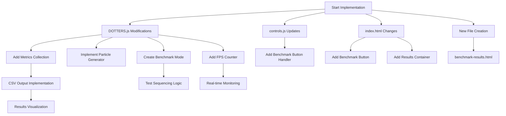
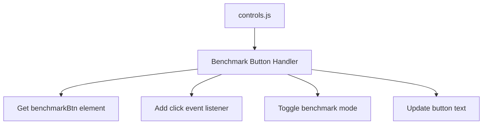
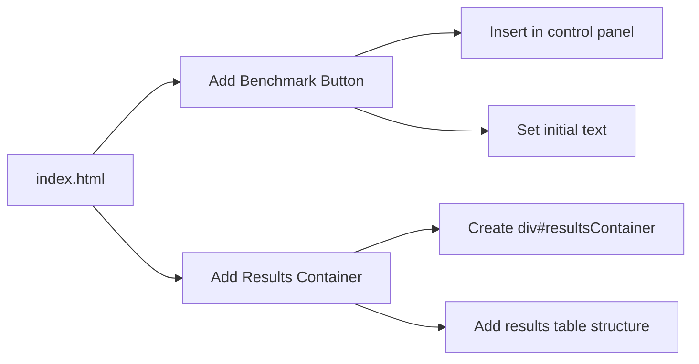
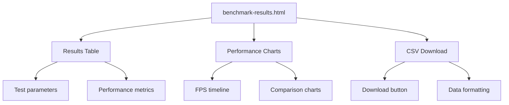
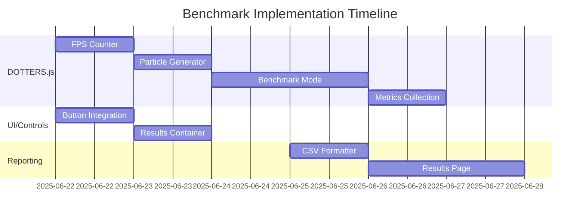

# DOTTERS Performance Benchmark Implementation Plan

## Implementation Phases

1. **FPS counter integration**
2. **Particle generator implementation**
3. **Benchmark mode infrastructure**
4. **Metrics collection system**
5. **Results visualization**

## File Modifications

### DOTTERS.js
- Add FPS counter variables and update logic
- Implement `generateParticles(count)` function
- Create benchmark mode infrastructure:
  - `benchmarkMode` flag
  - `testCases` array
  - `toggleBenchmark()` function
  - `runNextTest()` function
- Implement metrics collection in `recordResults(test)`
- Add CSV output generation

### controls.js
- Add benchmark button event handler

### index.html
- Add benchmark button in control panel
- Add results container div

### New File: benchmark-results.html
- Create results display page with table and charts

## Implementation Strategy



## Detailed Implementation Plan

### 1. DOTTERS.js Modifications
```mermaid
graph LR
    A[DOTTERS.js] --> B[FPS Counter]
    A --> C[Particle Generator]
    A --> D[Benchmark Mode]
    A --> E[Metrics Collection]
    A --> F[CSV Output]
    
    B --> B1[Add frame counting variables]
    B --> B2[Implement update logic in draw()]
    
    C --> C1[Create generateParticles()]
    C --> C2[Parameterized creation]
    
    D --> D1[Add benchmarkMode flag]
    D --> D2[Create testCases array]
    D --> D3[Implement toggleBenchmark()]
    D --> D4[Create runNextTest()]
    
    E --> E1[Add results array]
    E --> E2[Implement recordResults()]
    
    F --> F1[Create generateCSV()]
    F --> F2[Format results per spec]
```

### 2. controls.js Updates


### 3. index.html Changes


### 4. New File: benchmark-results.html


### 5. Implementation Sequence


### 6. Risk Mitigation
- Add try/catch blocks around benchmark operations
- Implement timeout safeguards
- Create benchmark validation tests
- Add progress indicators during long-running tests