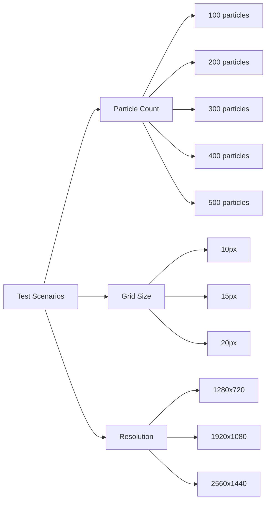
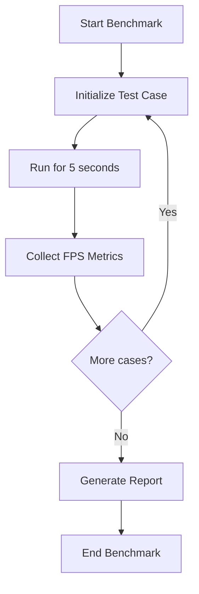
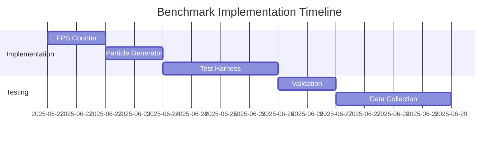

# DOTTERS Performance Benchmark Plan

## 1. Benchmark Objectives
- Determine particle count threshold where FPS drops below 60
- Identify performance bottlenecks in rendering pipeline
- Establish baseline metrics for optimization comparisons
- Evaluate impact of grid size and resolution on performance

## 2. Test Scenarios


## 3. Implementation Steps

### File: DOTTERS.js
1. **Add FPS counter** ([`DOTTERS.js:26`](DOTTERS.js:26)):
   ```js
   let fps = 0;
   let frameCount = 0;
   let lastFpsUpdate = 0;
   
   function draw() {
     // Existing code
     frameCount++;
     
     // Update FPS every second
     if (millis() - lastFpsUpdate > 1000) {
       fps = frameCount;
       frameCount = 0;
       lastFpsUpdate = millis();
     }
   }
   ```

2. **Create particle generator** ([`DOTTERS.js:92`](DOTTERS.js:92)):
   ```js
   function generateParticles(count) {
     for (let i = 0; i < count; i++) {
       particles.push({
         pos: new p5.Vector(random(width), random(height)),
         vel: new p5.Vector(random(-1, 1), random(-1, 1)).mult(2),
         life: 500
       });
     }
   }
   ```

3. **Add benchmark mode** ([`DOTTERS.js:120`](DOTTERS.js:120)):
   ```js
   let benchmarkMode = false;
   let currentTest = 0;
   const testCases = [
     {particles: 100, size: 15, width: 1280, height: 720},
     {particles: 200, size: 15, width: 1280, height: 720},
     {particles: 300, size: 15, width: 1280, height: 720},
     {particles: 400, size: 15, width: 1280, height: 720},
     {particles: 500, size: 15, width: 1280, height: 720},
     // Additional test cases
   ];
   
   function toggleBenchmark() {
     benchmarkMode = !benchmarkMode;
     if (benchmarkMode) runNextTest();
     return benchmarkMode;
   }
   
   function runNextTest() {
     if (currentTest >= testCases.length) {
       benchmarkMode = false;
       return;
     }
     
     const test = testCases[currentTest];
     updateParticleSize(test.size);
     resizeCanvas(test.width, test.height);
     clearCanvas();
     generateParticles(test.particles);
     
     // Run test for 5 seconds
     setTimeout(() => {
       recordResults(test);
       currentTest++;
       runNextTest();
     }, 5000);
   }
   ```

### File: controls.js
1. **Add benchmark UI controls** ([`controls.js:1`](controls.js:1)):
   ```js
   // Add to DOMContentLoaded
   const benchmarkBtn = document.getElementById('benchmarkBtn');
   benchmarkBtn.addEventListener('click', () => {
     if (window.DOTTERS) {
       const running = window.DOTTERS.toggleBenchmark();
       benchmarkBtn.textContent = running ? "Stop Benchmark" : "Start Benchmark";
     }
   });
   ```

## 4. Metrics Collection


## 5. Visualization Approach
- Implement real-time performance graph using p5.js
- Output CSV data with columns: 
  `test_case,particle_count,grid_size,resolution,avg_fps,min_fps`
- Create summary table in UI showing:
  - Test parameters
  - Average FPS
  - Min FPS
  - Performance rating

## 6. Proposed Timeline


## Next Steps
1. Review benchmark plan
2. Implement benchmark features
3. Execute tests across configurations
4. Analyze results and propose optimizations