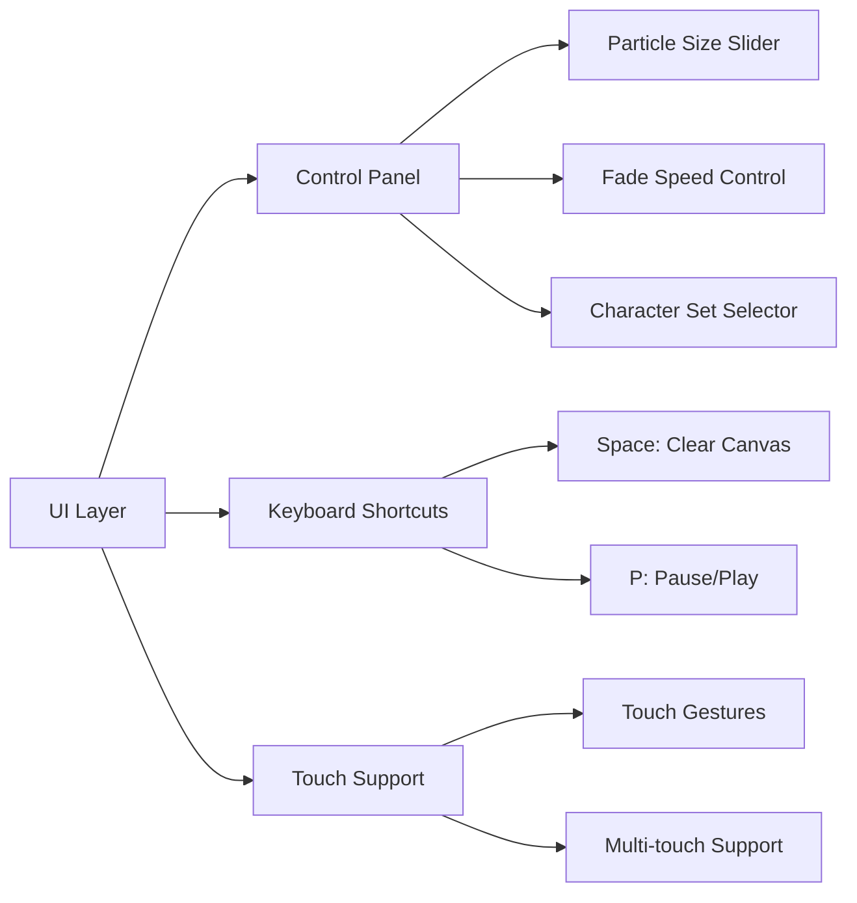
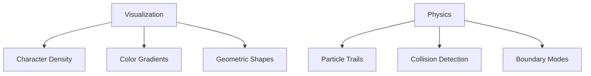
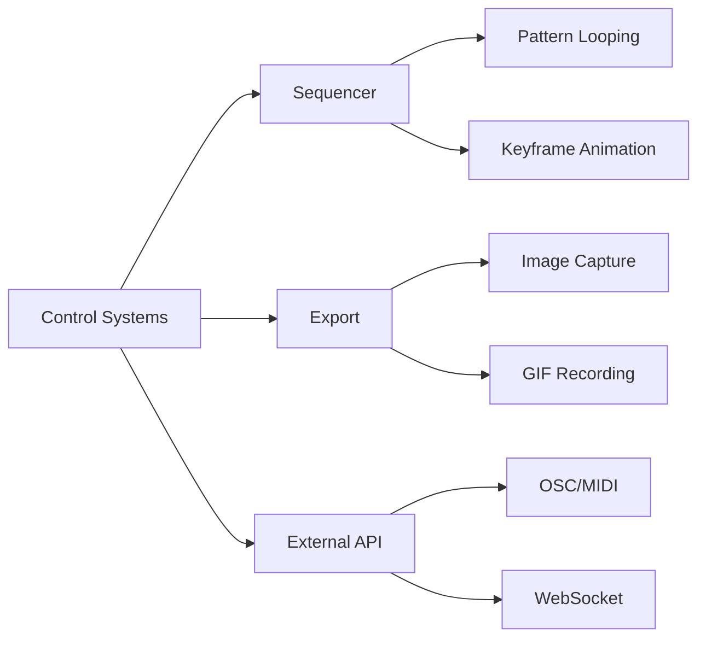

# DOTTERS Interactivity & Control Enhancement Plan

## Phase 1: Core UI & Controls (1-2 days)


**Files to modify:**
- `index.html`: Add control panel structure
- `DOTTERS.js`: Implement control handlers (lines 3-4, 6, 22-32)
- `styles.css` (new file): UI styling

## Phase 2: Visualization & Physics (2-3 days)


**Files to modify:**
- `DOTTERS.js`: Rendering system (lines 17-59, 61-68)
- `DOTTERS.js`: Particle physics (lines 71-73)
- `presets.js` (new file): Behavior configurations

## Phase 3: Advanced Control & Automation (2 days)


**Files to modify:**
- `control.js` (new file): Automation engine
- `export.js` (new file): Media export
- `DOTTERS.js`: API integration points

## Implementation Order
1. UI Control Panel (Phase 1)
2. Visualization Modes (Phase 2)
3. Physics Enhancements (Phase 2)
4. Preset System (Phase 3)
5. Automation Engine (Phase 3)

## Dependencies
- Phase 1 must complete before Phase 3 control features
- Physics enhancements require visualization modes
- Export functionality depends on completed rendering

## Estimated Timeline
```mermaid
gantt
    title Development Timeline
    dateFormat  YYYY-MM-DD
    section Core Features
    UI Controls     :a1, 2025-06-22, 2d
    Visualization   :a2, after a1, 3d
    section Advanced
    Physics         :a3, after a1, 2d
    Automation      :a4, after a2, 2d
    Export          :a5, after a2, 1d
## Git Quick Push Command
To quickly push changes to GitHub in the future, use this command:

```bash
git add . && git commit -m "Update: $(date +'%Y-%m-%d %H:%M')" && git push origin main
```

This command will:
1. Stage all changes (`git add .`)
2. Create a commit with a timestamped message
3. Push to the main branch

For a shorter version:
```bash
git add . && git commit -m "Update" && git push
```

> Always verify there are no sensitive credentials before pushing!