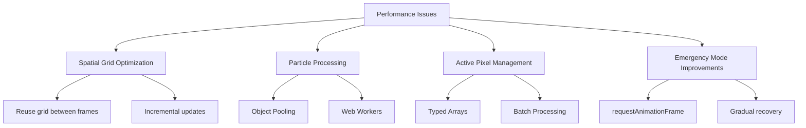
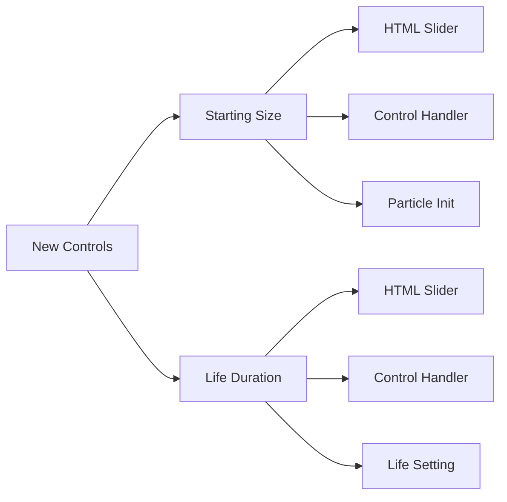

# Performance Optimization & Control Enhancement Plan

## 1. Performance Optimization Strategies


### Implementation Details:
- **Spatial Grid**: Modify [`DOTTERS.js:109-122`](DOTTERS.js:109) to reuse grid between frames with delta updates
- **Object Pooling**: Implement in [`DOTTERS.js:166-183`](DOTTERS.js:166) to reuse particle objects
- **Typed Arrays**: Replace `activePixels` Set with Uint32Array in [`DOTTERS.js:34`](DOTTERS.js:34)
- **Emergency Mode**: Use `requestAnimationFrame` instead of `setTimeout` in [`DOTTERS.js:199`](DOTTERS.js:199)

## 2. New Control Implementation


### HTML Changes:
```html
<!-- index.html -->
<div class="control-group">
  <label for="startSize">Starting Size</label>
  <input type="range" id="startSize" min="1" max="50" value="8">
  <div class="value-display"><span id="startSizeValue">8</span>px</div>
</div>

<div class="control-group">
  <label for="lifeSize">Life Duration</label>
  <input type="range" id="lifeSize" min="10" max="500" value="200">
  <div class="value-display"><span id="lifeSizeValue">200</span> frames</div>
</div>
```

### JavaScript Integration:
```javascript
// controls.js
const startSizeSlider = document.getElementById('startSize');
startSizeSlider.addEventListener('input', () => {
  if (window.DOTTERS) window.DOTTERS.updateStartSize(parseInt(startSizeSlider.value));
});

const lifeSizeSlider = document.getElementById('lifeSize');
lifeSizeSlider.addEventListener('input', () => {
  if (window.DOTTERS) window.DOTTERS.updateLifeSize(parseInt(lifeSizeSlider.value));
});

// DOTTERS.js
window.DOTTERS = {
  updateStartSize(newSize) {
    startSize = newSize;
  },
  updateLifeSize(newLife) {
    baseLife = newLife;
  }
};

// In mouseDragged/handleTouch:
particles.push({
  pos: new p5.Vector(mouseX, mouseY),
  vel: new p5.Vector(mouseX-pmouseX, mouseY-pmouseY).div(4),
  life: baseLife,  // Use controlled value
  size: startSize  // Use controlled value
})
```

## 3. Expected Performance Gains

| Optimization | Expected FPS Increase | Complexity Reduction |
|-------------|------------------------|----------------------|
| Spatial Grid | 15-20% | O(n) → O(1) updates |
| Object Pooling | 10-15% | Eliminates GC pauses |
| Typed Arrays | 5-10% | Faster iteration |
| Web Workers | 20-30% | Off-thread processing |

## Next Steps
Implementation will proceed in Code mode