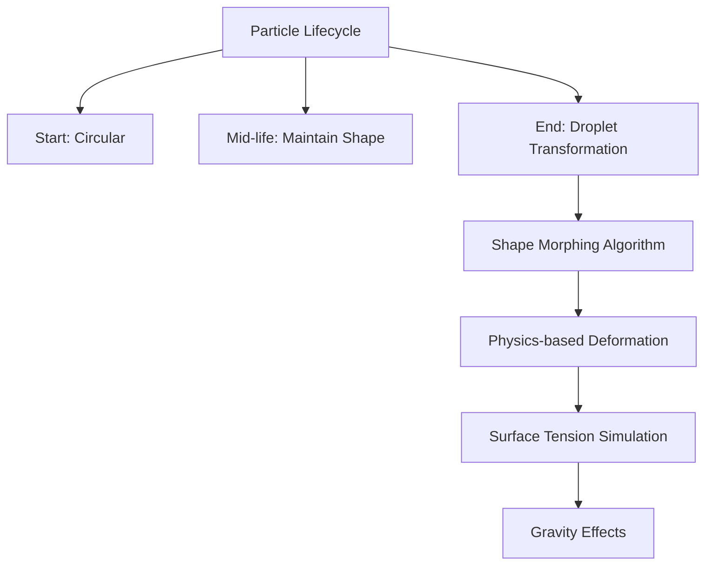
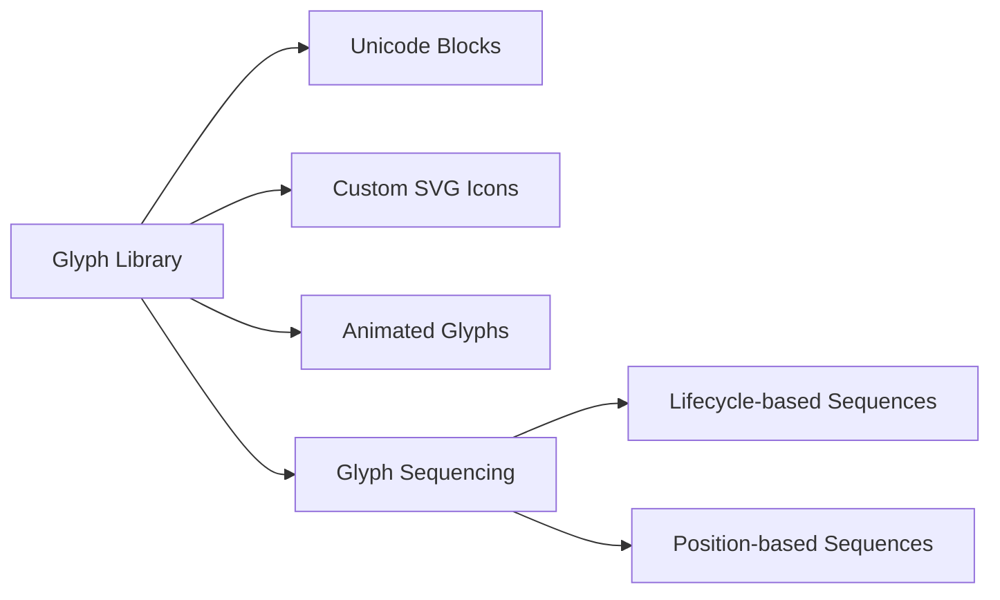
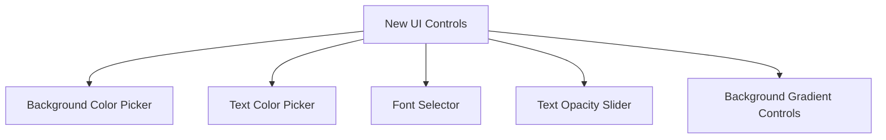

# Visual Enhancement Plan

## 1. Droplet Shape Endings


Implementation:
- Add `shapeMode` parameter to particles
- Implement droplet morphing in [`Particle.update()`](./DOTTERS.js):
  ```javascript
  if (this.age > 0.7 && this.shapeMode === 'droplet') {
    const dropletFactor = map(this.age, 0.7, 1, 0, 1);
    this.width = this.size * (1 + dropletFactor*0.5);
    this.height = this.size * (1 - dropletFactor*0.3);
  }
  ```
- Add UI toggle control

## 2. Enhanced Glyph System


Implementation:
- Expand character sets in [`DOTTERS.js`](./DOTTERS.js):
  ```javascript
  const advancedCharSets = [
    ['😀', '😎', '🤩', '😍', '🥳'], // Emoticons
    ['★', '✦', '❖', '◈', '⬟'],   // Symbols
    ['➜', '⇨', '➤', '⤷', '↻'],   // Arrows
    ['ꕥ', 'ꕤ', 'ꕦ', 'ꕧ', 'ꕨ']    // Custom
  ];
  ```
- Add glyph animation system:
  ```javascript
  updateGlyph() {
    if (this.glyphMode === 'animated') {
      const seqIndex = floor(map(this.age, 0, 1, 0, this.glyphSequence.length));
      this.char = this.glyphSequence[seqIndex];
    }
  }
  ```

## 3. Background & Text Controls


Implementation:
- Add controls to [`index.html`](./index.html):
  ```html
  <div class="control-group">
    <label for="bgColor">Background</label>
    <input type="color" id="bgColor" value="#000000">
  </div>
  <div class="control-group">
    <label for="textColor">Text Color</label>
    <input type="color" id="textColor" value="#ffffff">
  </div>
  <div class="control-group">
    <label for="fontSelect">Font</label>
    <select id="fontSelect">
      <option value="monospace">Monospace</option>
      <option value="sans-serif">Sans-Serif</option>
      <option value="serif">Serif</option>
    </select>
  </div>
  ```
- Connect to [`controls.js`](./controls.js):
  ```javascript
  bgColorInput.addEventListener('input', () => {
    window.DOTTERS.setBackgroundColor(bgColorInput.value);
  });
  textColorInput.addEventListener('input', () => {
    window.DOTTERS.setTextColor(textColorInput.value);
  });
  fontSelect.addEventListener('change', () => {
    window.DOTTERS.setFont(fontSelect.value);
  });
  ```

## Implementation Roadmap
1. Add droplet shape system
2. Implement expanded glyph library
3. Create appearance controls
4. Update documentation